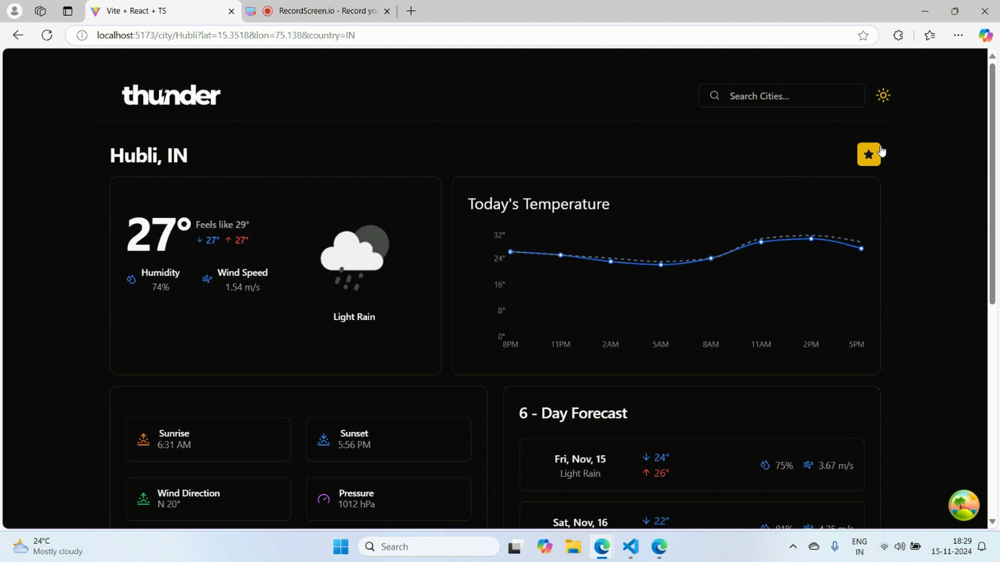
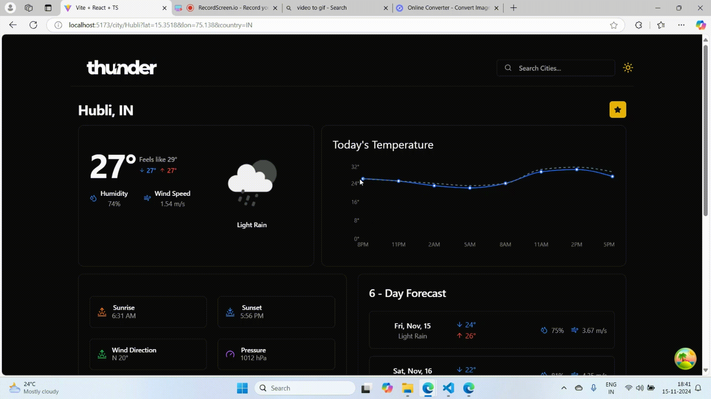

# Highlights

## Tech Used
- React
- React query(Tanstack query)
- Openweather Api
- Tailwind css
- Shadcn

## How to run locally

- Clone this repo
- Install All packages using npm i
- Signup for OpenWeather account create an access token generate API key `https://openweathermap.org/current`
- Create .env  file in root folder of app
- Create a new variable `VITE_OPEN_WEATHER_API_ACCESS_TOKEN` and assign the API Token
- Go to terminal run `npm run dev`